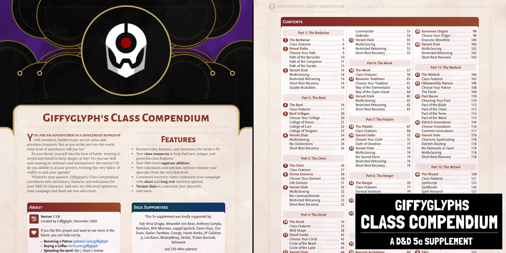

# Changelog

## Class Compendium

### v1.1.0

* Added new **Brutal Barbarian** subclasses.
    * **Path of the Conqueror:** Subjugate your enemies. Includes an integrated Loyalty system.
    * **Path of the Fanatic:** Punish the blasphemous and inspire the faithful.
* Added new **Brilliant Bard** subclasses.
    * **College of Dance:** Dazzle and distract your foes with calculated choreography.
    * **College of Tongues:** Study exotic languages and master Words of Power.
* Styles updated to match DD
* Various typos/corrections fixed.

### v1.0.0

* Added the **Brutal Barbarian**:
    * New Resource: Brutality.
    * New Features: Brutalities, Feral Movement, Mastered Rage.
    * **Path of the Berserker**: You are a frenzied force of destruction on the battlefield–enemies run in fear from your intimidating presence.
* Added the **Brilliant Bard**:
    * New Resource: Composition.
    * New Features: Composed Song of Rest, Composed Countercharm, Chords of Power.
    * **College of Lore:** You are a gatherer of knowledge and a seeker of truth, spinning little rumors into world-changing stories.
* Added the **Capable Cleric**:
    * New Resource: Faith.
    * New Features: Benedictions.
    * **Life Domain:** By channeling positive energy from your deity, you encourage life to flourish as you battle the forces of unnatural death and decay.
* Added the **Dynamic Druid**:
    * New Resource: Primal Power.
    * New Features: Dynamic Wild Shapes, Weald Walker.
    * **Circle of the Land:** You draw your power from the land itself to safeguard ancient knowledge and druidic rites.
    * **Circle of the Beast:** You are a gifted shapeshifter, and you switch between animal forms as easily as taking a breath.
* Added the **Fearless Fighter**:
    * New Resource: Resolve.
    * New Features: Maneuvers, Fighting Focus.
    * **Champion:** You and your weapon are one. In battle, you know how to best exploit an opening in your enemy's defense to deal massive damage.
    * **Defender:** You protect your allies from harm. When you stand fast and hold your ground, nothing can escape your defender's mark.
    * **Commander:** In the chaos of battle, you know how to take charge. You give orders and you expect those orders to be followed.
* Added the **Masterful Monk**:
    * New Features: Mantras, Lightning Flurry.
    * **Way of the Elementalist:** You can harness the raw power of the elements—earth, water, air, and fire—and bend them to your will.
    * **Way of the Open Hand:** You are a master of the martial arts, using special techniques to push, trip, and daze your opponents.
* Added the **Pious Paladin**:
    * New Resource: Conviction.
    * New Features: Smite, Voice of the Crusader.
    * **Oath of Devotion:** You have sworn to protect those who can't protect themselves. You fight those who would prey on the weak, and with conviction you heal the sick.
* Added the **Roving Ranger**:
    * New Resource: Scrap.
    * New Features: Survival Instincts, Hunter's Focus, Traps, Ranger's Prey, Ranger's Strike.
    * **Fey Walker:** You have a primal connection with the natural world, granting you magical power and an innate awareness of your surroundings.
* Added the **Rakish Rogue**:
    * New Resource: Focus.
    * New Features: Exploits, Roguish Fortune.
    * **Thief:** You have sticky fingers and a somewhat flexible attitude towards personal property—what belongs to other people, belongs to you.
* Added the **Supreme Sorcerer**:
    * New Resource: Sorcery.
    * New Features: Sorcerous Recovery, Metamorphosis.
    * **Draconic Bloodline:** Dragonsblood runs through your veins, granting you powerful magic and draconic gifts.
* Added the **Wicked Warlock**:
    * New Features: Fully reworked Pact Boons (including new Pact of the Wand), Sacrificial Bargain, Mystic Arcanum.
    * **The Fiend:** A powerful fiend from the hellish planes of existence offers you dark power in exchange for corruption, domination, and destruction.
* Added the **Wondrous Wizard**:
    * New Features: Spellscript, Spell Research, Spellscript Savant, Signature Spell.
    * **Evocation:** You are drawn towards powerful, element—and oftentimes destructive—arcane magic.
