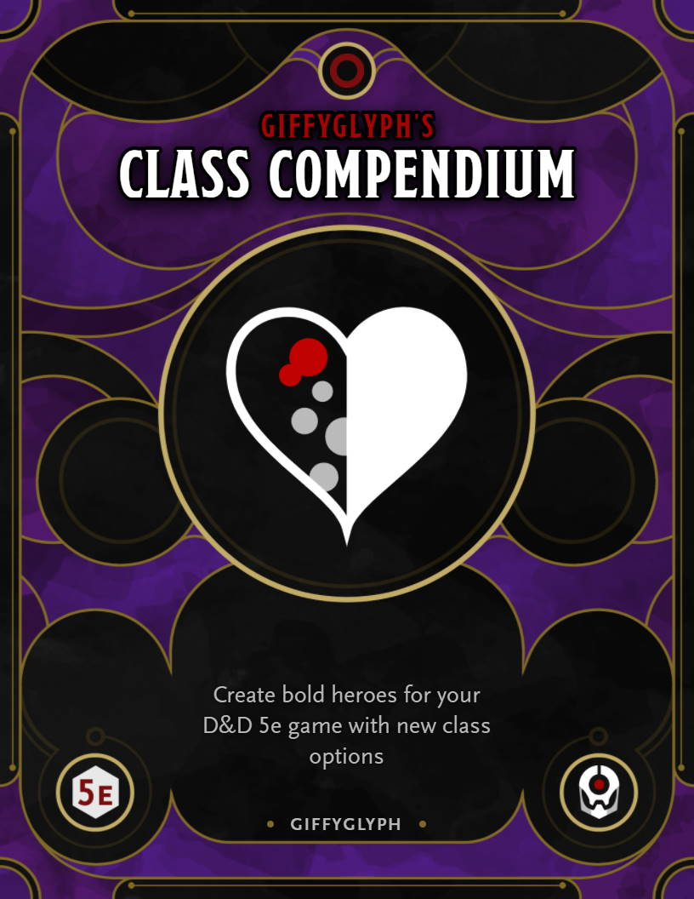

# Giffyglyph's Class Compendium

Do you want to cap D&D 5e at 10th-level with fully-rebalanced player classes? Then try **Giffyglyph's Class Compendium**: a full rewrite of all 12 PHB classes to support 1st-10th level gameplay!

* [Read the Latest PDF (v2.1.2)](https://github.com/giffyglyph/giffyglyphs-monster-maker/raw/master/releases/giffyglyphs_monster_maker_v2_1_2.pdf)
* [Read the Changelog](https://github.com/giffyglyph/giffyglyphs-monster-maker/blob/master/docs/CHANGELOG.md) 

## Features

* **Barbarian:** Destroy your enemies with new brutalities and mastered rage.
* **Bard:** Dazzle the crowd with chords of power.
* **Cleric:** Channel your faith and call on divine power.
* **Druid:** A completely new, flexible wild shape mechanic. Be the beast you want to be.
* **Fighter:** Control the battle with fighting maneuvers.
* **Monk:** Dash around your enemies with fluid mantras.
* **Paladin:** Protect your oath with conviction and brand new smites.
* **Ranger:** Be a spell-less ranger and capture your prey with traps.
* **Rogue:** Stay one step ahead with cunning exploits.
* **Sorcerer:** Take control of your magic with pure sorcery.
* **Warlock:** Completely rebalanced pact boons, and a new wand of destruction.
* **Wizard:** Master your spellcrafting with spellbooks and arcane research.

| Cover                                                    | Chapters (v1.1.2)                                           |
| -------------------------------------------------------- | ----------------------------------------------------------- |
|  |  |

## Roadmap

To see what's being worked on right now—and what may be planned for the future—check out the **[projects board](https://github.com/giffyglyph/giffyglyphs-class-compendium/projects)**.

## Bugs and Feature Suggestions

If you notice a bug or have a feature suggestion, visit the **[issue board](https://github.com/giffyglyph/giffyglyphs-class-compendium/issues)** and open a ticket. Please make sure to be as thorough as possible in your report and attach screenshots where appropriate, as low-effort tickets may be closed out-of-hand.

## Support

If you'd like to see more from this project in future, please consider [becoming a patron](https://www.patreon.com/giffyglyph). You can also find more of my work at:

* [giffyglyph.com](https://giffyglyph.com)
* [twitter](https://twitter.com/giffyglyph)
* [twitch.tv/giffyglyph](https://twitch.tv/giffyglyph)

## Licensing

This work is licensed under a [Creative Commons Attribution-NonCommercial-NoDerivatives 4.0 International License](http://creativecommons.org/licenses/by-nc-nd/4.0/).